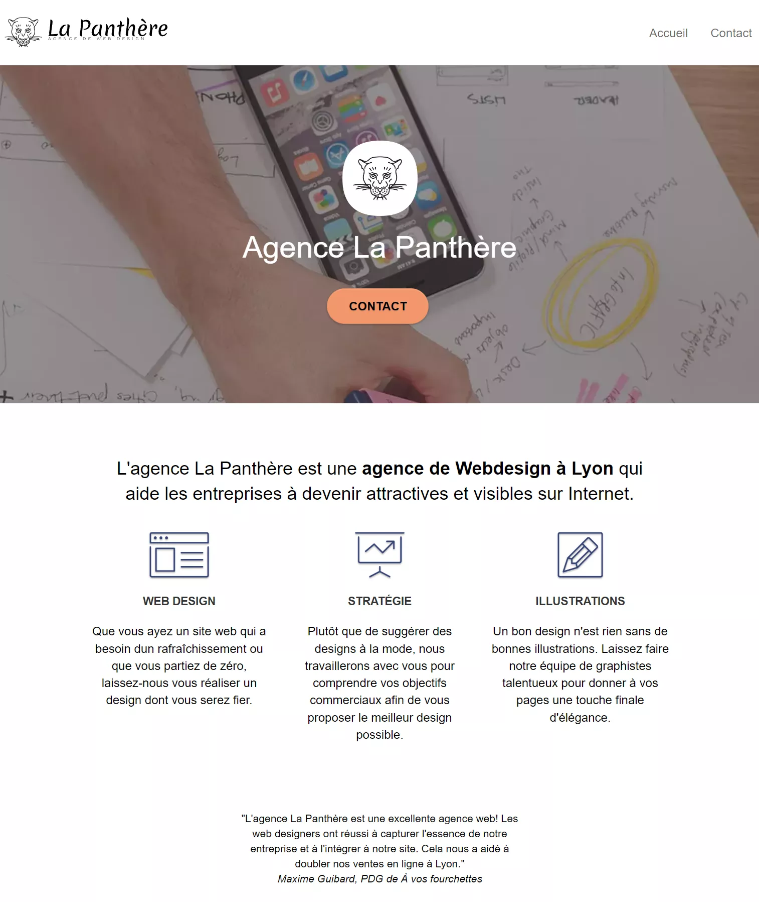

# Projet 4 La Panthère Agence de Web Design

Scénario : 

Vous travaillez pour l'agence La Panthère, une grande agence de web design basée à Lyon. L’activité de l’entreprise a bien démarré mais aujourd’hui, elle est en perte de vitesse. Eh oui, la concurrence est rude. La fondatrice de l’entreprise, Sophie, cherche une solution pour faire repartir l’activité. En tapant “Entreprise web design Lyon” sur Internet, elle s’aperçoit que le site de l’agence apparaît seulement en deuxième page des moteurs de recherche. Par chance, un de vos collègues, Martin, lui a dit que vous étiez un spécialiste en référencement.

## 1 - Analyse de l’état actuel de SEO du site fourni
- [x] - indiques les parties du site qui ne sont pas optimisées pour le seo.
- [x] - Martin voudrait qu’il y en ait au moins une sur la vitesse et la taille du site et une sur l’accessibilité.

## 2 - Amélioration du SEO du site.
- [x] - ensuite optimiser notre site en appliquant tes 10 recommandations à son contenu et à son code source.

## 3 - Comparaison des résultats.
- [x] - prendre des mesures pour accélérer la vitesse de chargement, et que tu me démontres que cela fonctionne.

Tu l’imagines, tous ces éléments devront être codés en HTML et CSS. Fais également attention à ce que le site soit toujours adapté à toutes les tailles d’écran après tes modifications.
Sophie Vasseur - Fondatrice de l'agence La Panthère
